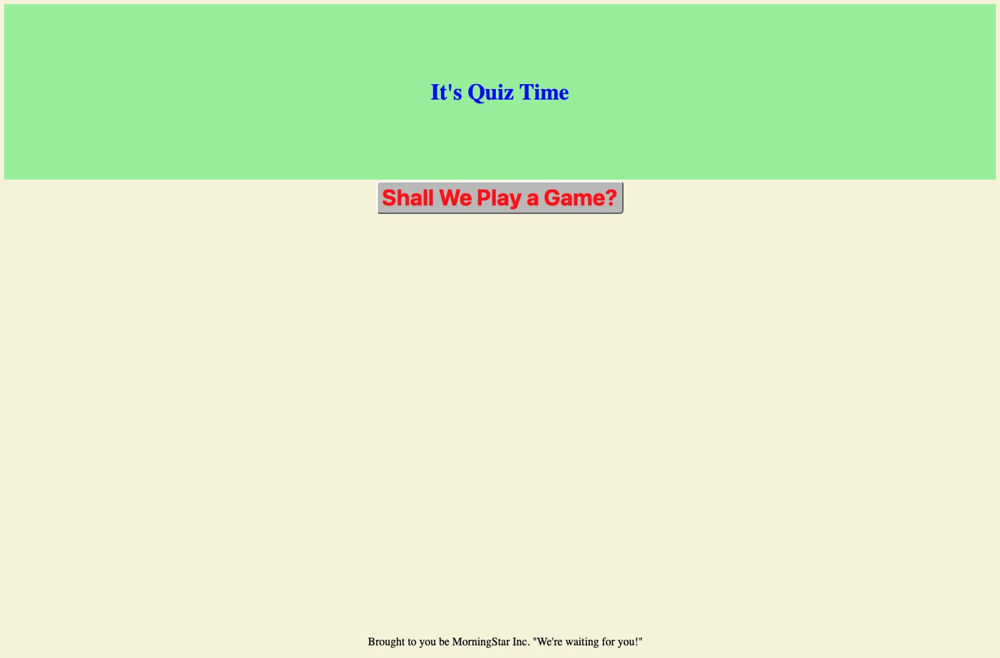

# Quiz_Time_TT
Create a Quiz
 Make a Quiz with at least 5 questions
 I begin with the pressing of a start button on a website.
 Like a bomb that will detonate, a timer starts to run
 A question is asked. 
 and then another
 when all questions are answered or time reaches 0 the game is over
 At the end, the user can save his/her initials and see the final score.

Like a failed contestant on Who wants to be a Millionaire, this project bamboozeled the audience into thinking that it would be easier than reality would soon reveal.
It all started with a button that kept logging the entries all the way back to the start.
The quiz builder looked to the internet for quidance, and soon realized that no one seemed to be having these issues.  Maybe a radio button quiz was a horrible idea, so the tenacious builder threw that idea in the trash and attempted another build.  The only problem was the button that moved through that was also throwing out errors.  Nothing would save.  It was like all those other contestants that froze in the middle of what the audience would have belived to be an easy question.  Hours passed and daylight faded. Attempts were made.  Data was logged.  ALERTS were sounded.  Yet, nothing seemed to work.
Was this going to be the end of the builder.  He was forced to go on a long trip and witnessed two trucks slam in to each other on the highway.  Was this a metaphor for life.  Was his highway being blocked by fellow travelers?
It would seem to be the case. The phantom button clicks were all around.  As he slept, all he could see were clicks, clicks, clicks...

It was finally the day the quiz had to be complete, and the Master Quiz builder came along.  She said, "Let me see that geosite's material."  The builder thougt to himself, "Retro-chic," but it was no time to argue the tastes that certain people have.

The master builder was at first stumped by this quiz.  The novice builder did not think this was part of the assignment, but he thought everyone loves a good challenge.
After several minutes, the error was seen.  The button was insane and wanted to click everything all the time.  Changes were made.  Fresh new buttons were added.
The "Retro-Chic" quiz would come to life after all.  Like the "phone a friend" feature, the builder was relieved that something would work!

He also realized that the documents that were submitted would likely give others a good head scratching as well...

 An impressive Quiz

 Links to the website
 https://dertodd.github.io/Quiz_Time_TT/
 https://github.com/DerTodd/Quiz_Time_TT
 ## The links of Destiny:
Website
[password generator](https://dertodd.github.io/Quiz_Time_TT/)
GitHub
[github repository](https://github.com/DerTodd/Quiz_Time_TT)